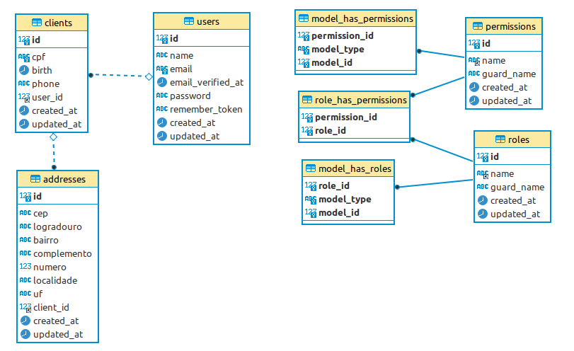
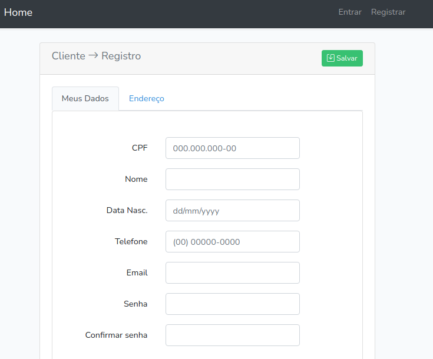
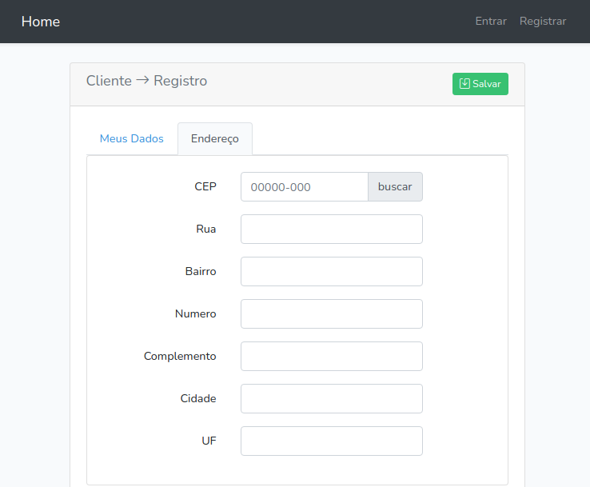
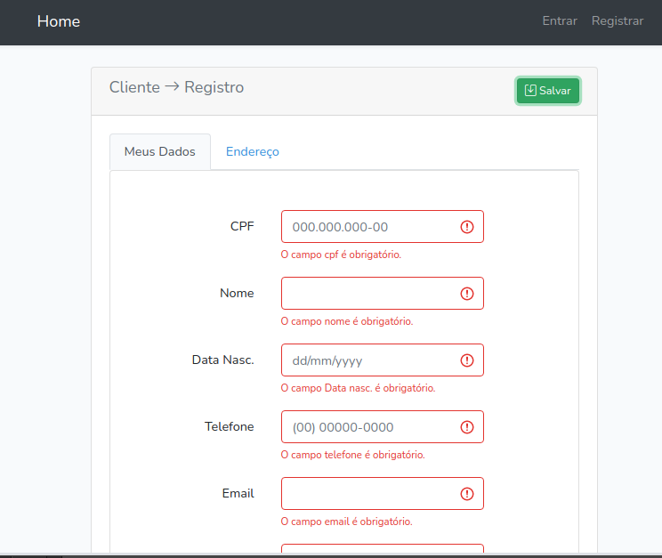
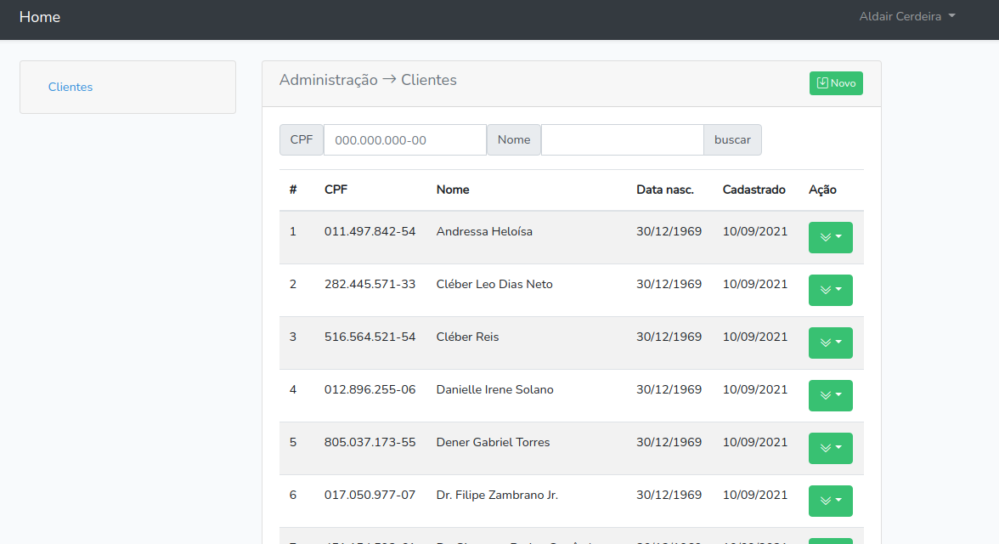
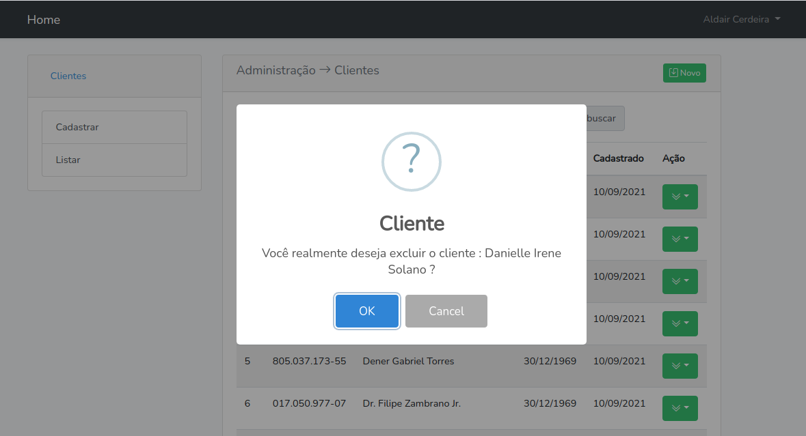
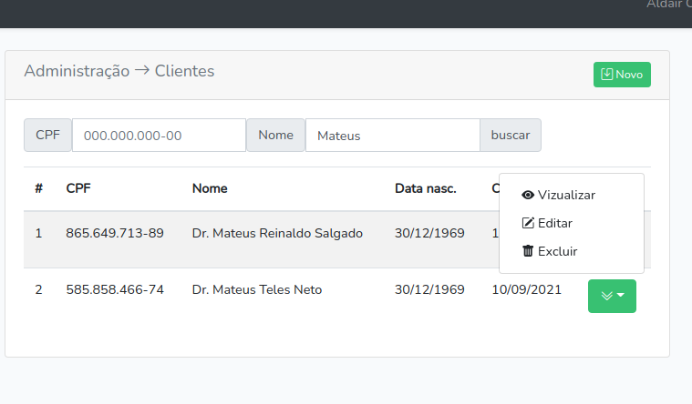

# Projeto Bemol

### Tecnologias utilizadas:

- Laravel 8
- Docker
- VueJs 2
- Bootstrap 4.6
- Bootstrap Icons

### Pacotes utilizados:

- laravel/sanctum: autenticação na Api
- spatie/laravel-permission: gerenciamento das funções e permissões do usúario no sistema
- vue-the-mask: validação dos inputs
- vue-filter-date-format: formatador de data
- vue-toastr: componete de mensagem flesh
- laravel-vue-pagination: componete de paginação
- vue-simple-alert: alerta em modal.


### Instalação
1 - Clonar repositorio
```bash
git clone https://github.com/aldaircerdeira2019/projeto-bemol.git
```

2 - rodar o docker
```bash
docker-compose up -d
```
3 - rodar para instalar as dependencias do PHP
```bash
docker-compose run web composer install
```
4 - rodar para instalar as dependencias do node
```bash
docker-compose run web yarn install
```
5 - rodar o build 
```bash
docker-compose run web yarn dev
```
6 - rodar as migrations e seed
```bash
docker-compose run web php artisan migrate --seed
```

7 - host http://localhost:8000/

### usuario para admin

    email      = admin@admin.com
    password   = 12345678

### O sistema

- back-end - api com duas camadas de seguranção, Middleware de autenticação e permissão de usuario.
- class seed e factory para popular o banco de dados
- banco de dados em container Docker
- ambiente de usuario Administrador e usuario Client
- Administrador: gerenciamento do crud de cliente: listagem, vizualização, cadastro, atualização e exclusão.
- filtro de busca por cpf ou nome.
- Cliente: crud cliente: cadastro e edição somente de seu perfil.
- validação por idade e por localozação.
- integração com a Api https://viacep.com.br/
- front-end em SPA single page application.

### Modelagem do Banco de dados


### Apresentação do sistema














